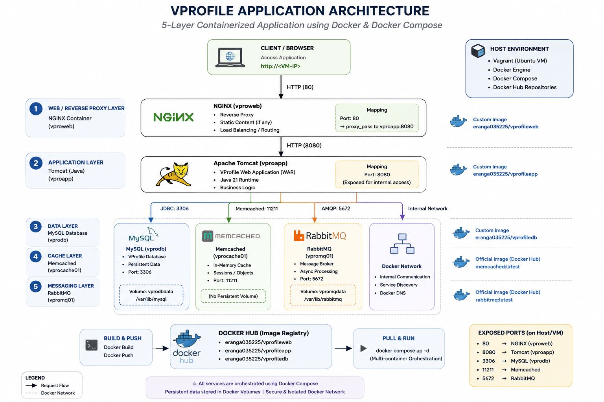

# 🚀 Dockerized 5-Tier VProfile Application Platform

A production-style multi-container deployment of the VProfile application using **Docker**, **Docker Compose**, **NGINX**, **Apache Tomcat**, **MySQL**, **RabbitMQ**, and **Memcached**.

The project demonstrates containerization, multi-stage Docker builds, service orchestration, networking, persistent storage, and reusable image publishing through Docker Hub.

---

# 📖 Overview

This project containerizes the complete VProfile application stack into independent services and orchestrates them using Docker Compose.

Each application component runs in its own isolated container while communicating through a dedicated Docker network, closely resembling a production microservice-style deployment.

---

# 🏗️ Architecture

<p align="center">

</p>

---

# 🐳 Technologies Used

- Docker
- Docker Compose
- Docker Hub
- NGINX
- Apache Tomcat
- MySQL
- RabbitMQ
- Memcached
- Vagrant
- Ubuntu Linux

---

# ⚙️ Architecture Components

- NGINX Reverse Proxy
- Tomcat Application Server
- MySQL Database
- RabbitMQ Message Broker
- Memcached Cache
- Docker Compose
- Docker Network
- Docker Volumes
- Docker Hub Images

---

# 🔄 Deployment Workflow

```text
Vagrant
      │
      ▼
Ubuntu VM
      │
      ▼
Docker Engine
      │
      ▼
Docker Compose
      │
      ├──────────────┐
      ▼              ▼
NGINX           Tomcat
                    │
       ┌────────────┼────────────┐
       ▼            ▼            ▼
   MySQL       RabbitMQ     Memcached
```

---

# 🚀 Features

- Production-style multi-container deployment
- Multi-stage Docker builds
- Docker Compose orchestration
- Custom NGINX image
- Custom Tomcat application image
- Custom MySQL image with automated initialization
- RabbitMQ integration
- Memcached integration
- Persistent Docker volumes
- Docker networking
- Docker Hub image publishing


# 📈 Key Learning Outcomes

- Docker Image Creation
- Multi-stage Docker Builds
- Docker Compose
- Multi-container Orchestration
- Docker Networking
- Docker Volumes
- Reverse Proxy Configuration
- Container Lifecycle Management
- Service Isolation
- Docker Hub Publishing

---

# 🛠️ Challenges Faced

- Container Networking
- Inter-Service Communication
- Docker Compose Dependencies
- NGINX Reverse Proxy Configuration
- MySQL Initialization
- Tomcat Deployment
- Volume Management
- Image Optimization

---

# 🔮 Future Improvements

- Kubernetes Deployment
- GitHub Actions CI/CD
- Amazon ECS Deployment
- Amazon EKS Migration
- Prometheus Monitoring
- Grafana Dashboards
- Trivy Security Scanning
- Argo CD GitOps Deployment

---

# 👨‍💻 Author

**Eranga Kavishanka**

- AWS Certified Cloud Practitioner (AWS CCP)
- Kubernetes and Cloud Native Associate (KCNA)
- Software Engineering Undergraduate
- DevOps | Cloud | Site Reliability Engineering (SRE)

---

## ⭐ If you found this project useful, consider giving it a Star!
